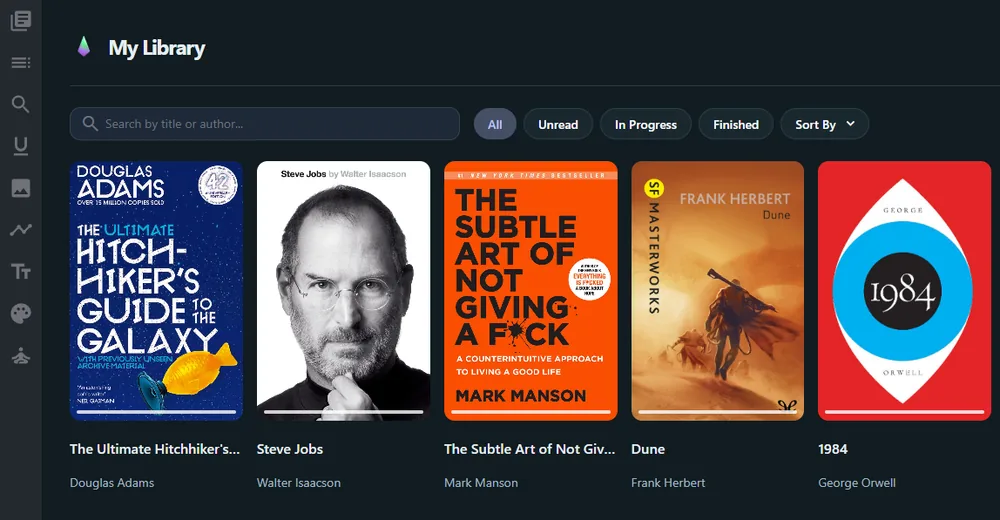
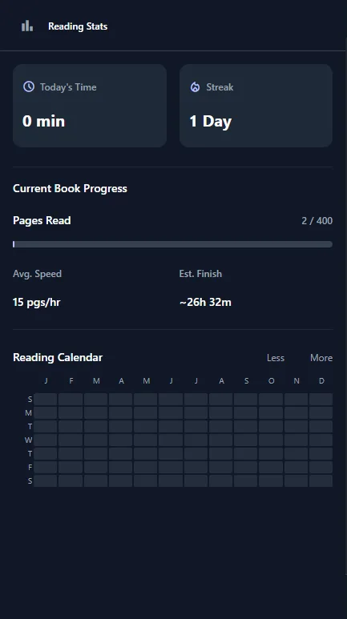

<div align="center">
  

# Lumen Read

A private, customizable EPUB reader for Firefox and Chromium browsers.

[](LICENSE)
[](apps/extension/manifests/firefox_manifest_v3.json)
[](https://pnpm.io/)

</div>

Lumen Read keeps reading at the center: local EPUB files, flexible typography,
notes, navigation, reading insights, and optional bring-your-own-key (BYOK) AI.

[Install Lumen Read from Firefox Add-ons](https://addons.mozilla.org/firefox/addon/lumen-read/)

## Highlights

- **Read your way** — customize fonts, spacing, themes, and layout globally or
  for one book at a time.
- **Stay focused** — use Zen Mode, dark mode, full-screen reading, and
  distraction-free controls.
- **Navigate confidently** — table of contents, timeline, in-book search,
  image preview, progress tracking, and reading locations.
- **Keep your notes** — highlight text, add annotations, and manage your
  reading library locally.
- **Understand your habits** — follow streaks and reading activity with a
  GitHub-style heatmap calendar.
- **Use AI only when you choose** — chat with a book, retrieve relevant
  excerpts, and use local or remote models from supported providers.

## Screenshots

<div align="center">
  
  <p><em>Library grid</em></p>

  
  <p><em>Reading analytics and activity heatmap</em></p>

</div>

## Privacy and optional connections

Lumen Read is local-first by default: books and ordinary reading data stay in
browser storage on your device.

- **AI is opt-in.** Remote AI features require you to choose a provider, grant
  the connection permission, and consent before book context is sent. The
  selected provider's own privacy terms apply to that request.
- **Keys are session-only.** Your AI API key is deliberately not persisted in
  browser `localStorage`.
- **Models are current, not hard-coded.** Choose an available model returned by
  your provider, or enter the ID offered by an approved compatible endpoint.
- **Local AI is optional.** Downloading local models and connecting to a local
  server both require an explicit action.
- **Dropbox sync is optional.** When enabled, selected library data is sent
  directly between your browser and Dropbox; it does not pass through a Lumen
  server.
- **No Sentry telemetry in extension releases.** Published extension builds do
  not include Sentry error or performance reporting.

Do not upload books unless you have the right to store, synchronize, or send
excerpts of them to the services you select.

## Install

### Firefox

Lumen Read is currently published for Firefox. Install the signed add-on from
[Firefox Add-ons](https://addons.mozilla.org/firefox/addon/lumen-read/) to receive
Mozilla-managed installation and updates.

For local development or temporary testing:

1. Build Firefox output with `pnpm build:ext:firefox:prod`.
2. Open `about:debugging#/runtime/this-firefox`.
3. Select **Load Temporary Add-on**.
4. Choose `apps/extension/dist/manifest.json`.

The `dist` folder is an unpacked development build. Temporary add-ons are removed
when Firefox restarts. The current manifest requires Firefox 128 or later.

### Chromium browsers

Lumen Read is not currently published in the Chrome Web Store. You can build and
load it manually in Chrome, Edge, Brave, and other Chromium browsers:

1. Run `pnpm build:ext:chrome:prod`.
2. Open the browser's extension page, for example `chrome://extensions`.
3. Enable **Developer mode**.
4. Select **Load unpacked** and choose `apps/extension/dist`.

### Package Firefox for AMO

Build output and a distributable archive serve different purposes. `dist` is for
local temporary loading through its `manifest.json`; the ZIP is the archive to
submit to Mozilla Add-ons. Mozilla signs the submitted release, and Firefox users
install that signed release directly from the add-on page.

From PowerShell:

```powershell
pnpm build:ext:firefox:prod
Set-Location apps/extension/dist
& ..\..\..\node_modules\.bin\bestzip.cmd ..\..\..\Lumen-firefox.zip *
```

## Development

### Prerequisites

- Node.js 18 or later
- pnpm 10.6.4
- Git

### Setup

```bash
git clone https://github.com/Zolangui/Lumen-Read.git
cd Lumen-Read
pnpm install
```

Start the development workspace:

```bash
pnpm dev
```

### Validate and build

```bash
# Type check the reader
pnpm --filter @flow/reader exec tsc --noEmit --incremental false

# Verify AI provider configuration without API keys
pnpm verify:providers

# Production builds
pnpm build:ext:chrome:prod
pnpm build:ext:firefox:prod
```

Each extension build writes browser-specific files to `apps/extension/dist`.
Build again for the target browser before loading or packaging it.

## Contributing

Bug reports, usability feedback, translations, and pull requests are welcome.

1. Open an issue with reproduction steps, expected behavior, browser version,
   and extension version.
2. Keep pull requests scoped and include validation results.
3. Do not commit personal books, API keys, OAuth tokens, generated extension
   packages, or other private data.

## License and attribution

Lumen Read is licensed under [AGPL-3.0-only](LICENSE). If you distribute a
modified build, provide the corresponding source code under the same license
and keep the license and notices intact.

Lumen Read is an enhanced fork of [Flow](https://github.com/pacexy/flow).
Thanks to Flow, EPUB.js, React, Next.js, and the open-source projects that make
this reader possible.
